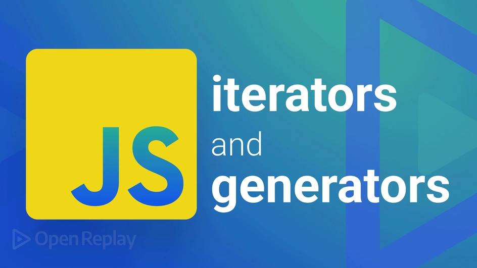

> [원문](https://blog.openreplay.com/deep-dive-into-javascript-s-iterators-iterables-and-generators)을 번역한 글입니다!

<br>

자바스크립트에서 `for...of loop` 같은 기본 연산은 `Iterators`, `Iterables`, 그리고 `Generators`의 개념에 의해 동작됩니다. 이러한 개념은 자바스크립트가 제공하는 기능 중 특정 데이터 구조의 요소를 하나씩 순회하는 `for...of loop`과 같이, 데이터 구조(Data Structure)에서 반복하기 위한 프로토콜 역할을 합니다.

이 글에서는 이 개념에 대해 논의하고 탐색한 뒤 자바스크립트 프로젝트에서 어떻게 구현하는가에 대해 알아보겠습니다.

## Symbols for iterators
이 개념을 설명하기 전에, 단위 블록에 커스텀 반복 기능을 구현하는 자바스크립트 내장 메서드인 [Symbol.iterator()](https://developer.mozilla.org/en-US/docs/Web/JavaScript/Reference/Global_Objects/Symbol/iterator)에 대해 간략하게 알아보겠습니다.

```js
// syntax
Symbol.iterator() // Symbol(Symbol.iterator)
```

[Iterable](https://developer.mozilla.org/en-US/docs/Web/JavaScript/Reference/Iteration_protocols#the_iterable_protocol)은 `Symbol.iterator key`를 가진 모든 구조로 다음과 같은 동작을 수행합니다.

- `for..of loop`의 경우, 실행되면 먼저 오류를 찾습니다. 찾을 수 없으면 메서드와 메서드가 정의된 객체에 접근합니다.
- 객체는 `for..of loop` 상에서 반복됩니다.
- 그런 다음 해당 출력 객체의 `next()` 메서드를 사용하여 반환할 다음 값을 가져옵니다.
- 반환된 값은 `done: boolean, value: any` 타입을 사용합니다. `done: true`가 반환 된다면 반복이 종료됩니다.

```js
let list = {
  start: 2,
  end: 7,
};

list[Symbol.iterator] = function () {
  return {
    now: this.start,
    end: this.end,
    next() {
      if (this.now <= this.end) {
        return { done: false, value: this.now++ };
      } else {
        return { done: true };
      }
    },
  };
};

for (let i of list) {
  console.log(i);
}

//output
2
3
4
5
6
7
```

자바스크립트에서 Array 객체는 가장 본질적으로 반복이 가능한 객체입니다. 0부터 무한대까지의 정수를 표현할 때, 반복 가능한 속성으로 바뀔 수 있죠. 이 문서는 사용자가 지정하는 커스텀 반복 가능 항목을 이해하고 구현하는 데 도움이 될 겁니다.

<br>

## Iterator and Iterable in JavaScript
모든 데이터 배열에 대한 반복은 다음과 같이 요소 위에서 전통적인 `for loop`을 사용하여 반복하는 것입니다.

```js
let items = [1, 2, 3];

for (let i = 0; i < items.length; i++) {
    console.log(items[i]);
}

//output
'1'
'2'
'3'
```

위의 코드는 잘 동작하지만 반복문 내부에 반복문을 중첩할 때 복잡성이 늘어납니다. 이런 복잡성은 반복과 관련된 여러 변수를 추적하려는 시도에서 파생됩니다.

반복 시 순서(Index)를 기억하고 반복문에 대한 복잡성을 줄이기 위해 [ECMAScript 2015](https://262.ecma-international.org/6.0/)는 `for...of loop` 구조를 개발했습니다.

이 시도는 더 깨끗해진 코드를 작성할 수 있게 하지만, 그보다 중요한 것은 `for...of loop`가  배열뿐만 아니라 반복 가능한 모든 객체를 iterate/loop 할 수 있다는 것이에요.

> 파랑의 주석) * iterate/loop 두 가지를 '반복'이라는 단어로 표현하기에는 어폐가 있어서 이렇게 표기합니다.

[iterator](iterator)는 키-값 쌍을 가진 객체를 반환하는 `next()` 메서드를 구현한 객체입니다.

```js
{ value: any, done: boolean }
```

`Symbol.iterator()`에 대한 앞선 논의를 인용하자면, 우리는 `next()` 메서드가 인수를 허용하지 않고 키-값 쌍의 객체를 반환하는지 알고 있습니다.

이를 기억하고 커스텀 객체 타입에 대해 `for...of loop`를 사용하여 커스텀 반복 프로세스를 구현하면 반복이 성공적으로 수행됩니다. 아래는 지정한 간격(시작, 종료) 중에 윤년 목록을 반환하는 객체를 만들고자 하는 코드입니다.

```js
class LeapYear {
  constructor(start = 2020, end = 2040, interval = 4) {
    this.start = start;
    this.end = end;
    this.interval = interval;
  }

  [Symbol.iterator]() {
    let nextLeapYear = this.start;
    return {
      next: () => {
        if (nextLeapYear <= this.end) {
          let result = { value: nextLeapYear, done: false };
          nextLeapYear += this.interval;
          return result;
        }
        return { value: undefined, done: true };
      },
    };
  }
}
```

위의 코드는 커스텀 타입인 `LeapYear`에 대해 `Symbol.iterator()` 메서드를 구현한 것입니다. 우리는 `this.start` 필드와 `this.end` 필드에 반복의 시작점과 끝점을 가지고 있죠. `this.interval`을 사용하여, 우리는 반복의 첫 번째 요소와 다음 요소 사이의 간격을 추적할 수 있습니다.

이제 커스텀 타입에서 `for...of loop`을 호출함으로써 기본 배열 타입처럼 동작하는 것과 출력된 값을 확인할 수 있습니다.

```js
let leapYears = new LeapYear();

for (const leapYear of leapYears) {
    console.log(leapYear);
}

// output
2020
2024
2028
2032
2036
2040
```

앞서 언급했듯이 `Iterable`은 배열, 문자열, 집합과 같은 `Symbol.iterator()` 메서드를 사용하는 자바스크립트 구조체입니다. 결과적으로, 우리가 작성한 `LeapYear type`도 `Iterable`이죠. 이것이 `Iterator`가 가진 `Iterable`의 기본 개념입니다. 자세한 내용은 [여기](https://developer.mozilla.org/en-US/docs/Web/JavaScript/Guide/Iterators_and_Generators)를 참조해주세요.

<br>

## Generators in Javascript
[Generator](https://developer.mozilla.org/en-US/docs/Web/JavaScript/Reference/Global_Objects/Generator)는 많은 출력 값을 생성할 수 있는 기능으로, 일시 중지되었다가 재개될 수 있습니다. 자바스크립트에서 Generator는 `iterable`한 `Generator 객체`를 생성하는 전통적인 함수와 같지만 동작으로는 실행 종료되어 단일 값을 반환하는 전통적인 함수와 반대됩니다. Generator는 새로운 키워드인 `yield`을 사용하여 Generator 함수의 내부 실행을 일시 중지하고 값을 반환합니다. 자세한 내용은 [여기](https://developer.mozilla.org/en-US/docs/Web/JavaScript/Reference/Iteration_protocols)를 참조해주세요.

다음은 Generator를 선언하는 기본 문법입니다.

```js
function* generator() {} // Object [Generator] {}
```

Generator와 yield가 어떻게 동작하는지 살펴볼까요?

```js
function* generate() {
  console.log("invoked first time");
  yield "first";
  console.log("invoked second time");
  yield "second";
}

let gen = generate();
let next_value = gen.next();
console.log(next_value);

// output
// <- invoked first time
// <- {value: 'first', done: false}

next_value = gen.next();
console.log(next_value);

// output
// <- invoked second time
// <- {value: 'second', done: false}
```

Generator는 `Symbol.iterator`와 유사한 객체를 생성합니다. done 및 value 필드입니다. 문맥상으로, 이건 Generator 타입이 반복 가능하다는 것을 알려주죠. 즉 `for ...of loop`를 사용하여 반환된 값을 반복할 수 있습니다. `for...of loop`를 사용하면 반복을 추적하기 때문에 완료 필드를 반환할 필요 없이 필드 내의 값을 반환할 수 있어요. `for ...of loop`는 이전 코드 블록에서 사용된 구현을 추상화하는 문법적 설탕(Sugar Syntax)입니다.

```js
function* generate() {
  console.log("invoked first time");
  yield "first";
  console.log("invoked second time");
  yield "second";
}

let gen = generate();

for (let value of gen) {
  console.log(value);
}

// output
//invoked first time
//first
//invoked second time
//second
```

또는, 우리는 LeapYear type에 Generator 개념을 사용하여 반복을 구현할 수 있습니다. 업데이트된 코드는 아래를 확인해주세요.

```js
class LeapYear {
    constructor(start = 2020, end = 2040, interval = 4) {
      this.start = start;
      this.end = end;
      this.interval = interval;
    }
    *[Symbol.iterator]() {
      for (let index = this.start; index <= this.end; index += this.interval) {
        yield index;
      }
    }
  }
```

간결하게 리팩터링된 위 코드는 이전과 동일한 결과를 나타냅니다.

```js
// output
2020
2024
2028
2032
2036
2040
```

위의 코드는 2020년부터 2040년까지 윤년을 생성하기 위한 윤년 반복기를 구현하는 것입니다. `Symbol.iterator` 메서드를 사용하는 것이 `Generator`를 사용하는 것보다 훨씬 간단해요.

<br>

## Generator vs. Async-await — AsyncGenerator
[async/await](https://developer.mozilla.org/en-US/docs/Web/JavaScript/Reference/Statements/async_function) 함수를 모방하기 위해 `Generator/yield`를 사용하면 "기다리는" 코드, 보류 중인 실행 또는 비동기적으로 보이는 코드의 비동기 동작을 모두 시뮬레이션할 수 있습니다. Generator 함수의 iterator(next 메서드)는 각 대기 시간을 순차적으로 실행하는 비동기 대기 대신 yield-expression을 한 번에 하나씩 실행합니다. async/await 함수의 경우 반환 값은 항상 임의의 값으로 **resolve** 되거나 오류를 발생시키는 Promise입니다. 반대로 Generator의 반환 값은 항상 `{value:X, done:Boolean}`이며, 이런 함수 중 하나가 다른 함수로부터 빌드된 것으로 결론 지을 수 있습니다. 짜잔! 비동기 함수가 Generator와 Promise 구현으로 분리될 수 있다는 것을 이해하면 큰 도움이 될 거에요.

이제 Generator와 async/await를 결합하면 새로운 유형인 [AsyncGenerator](https://developer.mozilla.org/en-US/docs/Web/JavaScript/Reference/Global_Objects/AsyncGenerator)가 탄생합니다. 기존의 Generator와 달리 AsyncGenerator의 next() 메서드는 Promise를 반환합니다. AsyncGenerator를 통해 반복하려면 `for wait... of construct`를 사용합니다.

아래 코드는 외부 데이터를 비동기적으로 가져오기 위해 요청한 뒤 값을 yield 합니다.

```js
let user = {
  request: 0,
  trials: 12,
};

async function* fetchProductButton() {
  if (user.trials == user.request) {
    return new Error("Exceeded trials");
  }
  let res = await fetch(`https://dummyjson.com/products/${user.request + 1}`);
  let data = await res.json();
  yield data;
  user.request++;
}

const btn = fetchProductButton();

(async () => {
  let product = await btn.next();
  console.log(product);
  // OR
  for await (let product of btn) {
    console.log(product);
  }
})();
```

위의 코드는 아래의 JSON 데이터를 반환합니다.

```js
//output
{
  value: {
    id: 1,
    title: 'iPhone 9',
    description: 'An apple mobile which is nothing like apple',
    price: 549,
    discountPercentage: 12.96,
    rating: 4.69,
    stock: 94,
    brand: 'Apple',
    category: 'smartphones',
    thumbnail: 'https://dummyjson.com/image/i/products/1/thumbnail.jpg',
    images: [
      'https://dummyjson.com/image/i/products/1/1.jpg',
      'https://dummyjson.com/image/i/products/1/2.jpg',
      'https://dummyjson.com/image/i/products/1/3.jpg',
      'https://dummyjson.com/image/i/products/1/4.jpg',
      'https://dummyjson.com/image/i/products/1/thumbnail.jpg'
    ]
  },
  done: false
}
```

위 코드 예제는 세션 액세스가 무효화 되지 않은 한 값을 얻기 위해 계속 세션 액세스를 시뮬레이션하는 예제입니다. AsyncGenerator를 사용하면 외부 API에 페이지화된 요청을 수행하거나, 비즈니스 로직을 프레임워크의 진행 보고(Progress 등)에서 분리하는 데 도움이 되므로 유연성이 보장됩니다. 또한 [Mongoose의 cursor](https://mongoosejs.com/docs/api/querycursor.html)를 사용하여 명령줄 또는 [웹 소켓](https://developer.mozilla.org/en-US/docs/Web/API/WebSockets_API)을 업데이트하면서 모든 문서를 반복할 수 있습니다.

<br>

## Built-in APIs accepting iterables
다양한 API가 iterable을 지원합니다. 예를 들어 Map, WeakMap, Set 및 WeakSet 객체가 있죠. 반복할 수 있는 자바스크립트 API는 [이 MDN 문서](https://developer.mozilla.org/en-US/docs/Web/JavaScript/Reference/Iteration_protocols#built-in_apis_accepting_iterables)를 확인해주세요.

<br>

## Conclusion
여러분은 이 글에서 자바스크립트 iterator와 반복 프로토콜을 사용하여 커스텀 iteration 로직을 구성하는 방법에 대해 배웠습니다. Generator가 iterator로서 객체 값의 종류를 산출(yields)하는 함수/객체 타입이라는 것도요. 거의 사용되지 않아도 웹 애플리케이션의 프론트엔드에서 무한 데이터 스트림을 통해 무한 스크롤과 음파 데이터 그 이상의 것들을 처리할 수 있는 자바스크립트의 강력하고 유연한 기능입니다. 이것들은 상태를 유지하여 iterators를 만드는 효과적인 기술을 제공하죠. Generators는 Promise와 결합할 때 async/await 기능을 모방할 수 있으며, 이를 통해 비동기 코드를 보다 직접적이고 읽기 쉬운 방식으로 처리할 수 있습니다.